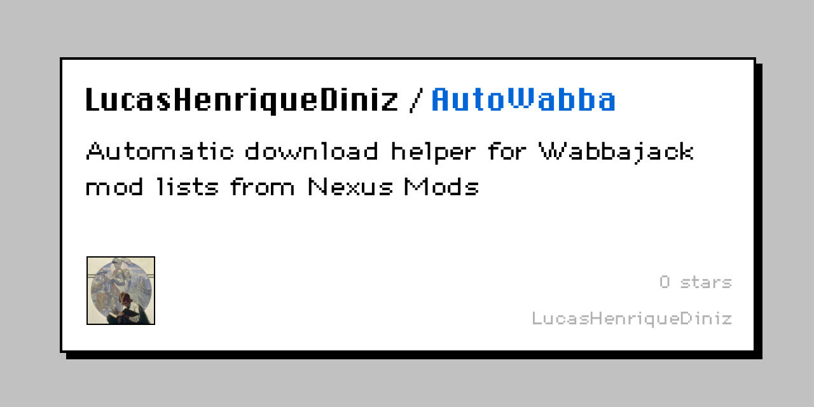
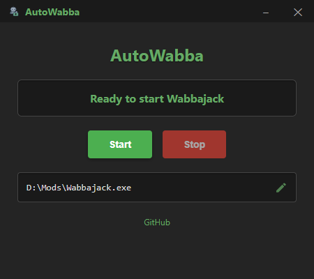

# AutoWabba

**Automatic Download Helper for Wabbajack**

AutoWabba automates the process of downloading mods from Nexus Mods when using Wabbajack mod lists by automatically clicking download buttons.

## Features



- **Automatic Download Clicking**: Automatically clicks download buttons on Nexus Mods pages
- **Error Recovery**: Detects and handles error pages and browser issues
- **Persistent Configuration**: Saves Wabbajack path for future use
- **Simple Interface**: Clean interface with just Start/Stop controls

## Requirements

- Windows 10/11
- Wabbajack mod manager
- Nexus Mods account (free)

## Installation

1. Download the latest release from the [Releases page](https://github.com/LucasHenriqueDiniz/AutoWabba/releases)
2. Run `AutoWabba.exe`

> **Note:** Windows Defender or other antivirus software may flag this program as a virus. This is a false positive due to the automation and packaging methods used. In the future, we plan to add a code signing certificate to further reduce these warnings. You can check the [VirusTotal scan here](https://www.virustotal.com/gui/file/494c6e157d1280abc9d78e2874efd112ac3b97877492b38f9d0dd46887947570/behavior). The full source code is available on GitHub for your review.

## ⚠️ Known Issues

Please be aware that there are still some **minor issues** during use. See the [Known Issues](https://github.com/LucasHenriqueDiniz/AutoWabba/issues) page for updates.

- Sometimes Nexus Mods detects "suspicious behavior" and logs the user out, which causes the download to stall until you log in again.
- Occasionally, the mod download page may close unexpectedly — usually related to the logout issue — and may require manual intervention (just close the tab and wabbajack will reopen).

## Status Bar Meanings

The status bar at the bottom of the app shows what AutoWabba is doing:

- **Ready to start Wabbajack**: The app is ready. Select your Wabbajack.exe and click Start.
- **Starting...**: Wabbajack is being launched or detected.
- **Waiting for browser... (X)**: Wabbajack is running, but no mod download page is open yet. Open a modlist and proceed until Wabbajack starts opening Nexus Mods pages. (X = number of downloads so far)
- **Running - Automation active (X)**: AutoWabba is actively monitoring and clicking download buttons. (X = number of downloads so far)
- **Stopped (Total: X)**: Automation has stopped. X is the total number of downloads AutoWabba clicked during this session.

## Usage

1. **Open AutoWabba**: Start the app by running `AutoWabba.exe`.
2. **Select Wabbajack**: Click the edit icon next to the path to select your `Wabbajack.exe` (only needed the first time).
3. **Start Wabbajack via AutoWabba**: Click "Start" in AutoWabba. This will launch Wabbajack in debug mode, ready for automation.
4. **Select Your Modlist**: In Wabbajack, choose the modlist you want to install, select the install location, and proceed as usual.
5. **Proceed to Download Phase**: Continue in Wabbajack until it starts opening browser pages for Nexus Mods downloads. AutoWabba will detect these pages and begin clicking download buttons automatically.
6. **Login to Nexus Mods if Needed**: If prompted, log in to your Nexus Mods account. (Note: You may need to log in again because AutoWabba uses a separate Edge/Chromium instance for automation.)
7. **Let AutoWabba Work**: The status bar will update as downloads are processed. You can monitor progress and stop automation at any time by clicking "Stop".

## How It Works

AutoWabba uses Chrome DevTools Protocol to connect to Wabbajack's embedded browser (WebView2) and automatically clicks download buttons when Wabbajack opens Nexus Mods pages.

## Error Handling

The tool includes robust error handling:

- **Download Stuck**: Automatically retries after 10 attempts
- **Error Pages**: Detects and waits for recovery
- **Browser Issues**: Monitors for multiple error pages and waits longer

## Planning

- [ ] Add code signing certificate to future releases to further reduce false positives from antivirus software.
- [ ] May add a refresh login or smething

## Development

To run from source:

```bash
npm install
npm start
```

## License

MIT License - see [LICENSE](LICENSE) file for details.

## Author

Lucas Henrique Diniz

---

**Note**: This tool is designed to work with Wabbajack mod lists and Nexus Mods. Make sure you comply with Nexus Mods' terms of service and rate limits.
