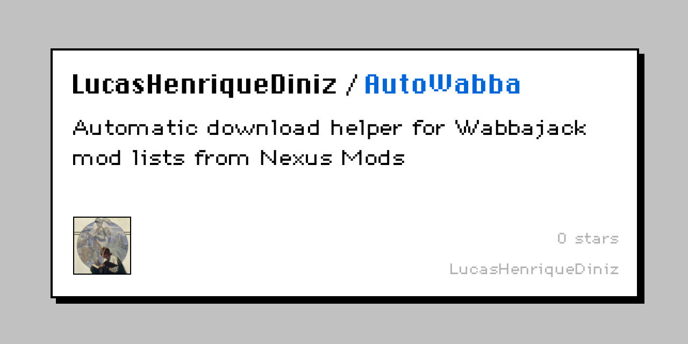
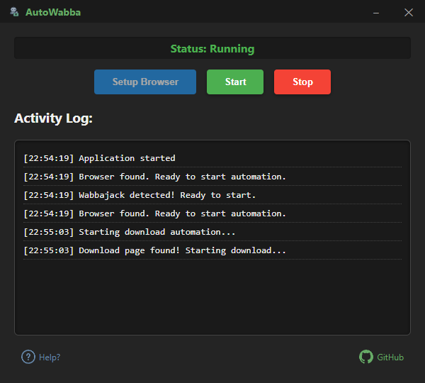

  
# AutoWabba

### Automatic download helper for Wabbajack mod lists from Nexus Mods

### [⬇️ Download Latest Version ⬇️](https://github.com/LucasHenriqueDiniz/AutoWabba/releases/latest)

AutoWabba makes the installation process of large modpacks completely automated by handling the download interaction with Nexus Mods.

  

**Note**: Currently only works with Nexus Mods downloads.

## Features

- Automatic detection of Nexus Mods download pages
- One-click setup for browser automation
- Elegant user interface
- Automatic click on download buttons
- Real-time status updates

## Prerequisites

- Windows 10/11
- [Wabbajack](https://www.wabbajack.org/) installed
- Microsoft Edge or Edge WebView2 Runtime
- Nexus Mods account (must be logged in within Wabbajack)

## Installation

1. Download the latest release from the download button above
2. Extract the ZIP file to a location of your choice

## Usage

1. Make sure you're logged into your Nexus Mods account in Wabbajack
2. Run AutoWabba.exe
3. Click "Setup Browser" button
4. Open Wabbajack and start installing your mod list
5. Click "Start" in AutoWabba
6. Sit back and relax! The tool will automatically handle downloads

## How It Works

AutoWabba automates the download process using these technical steps:

1. Opens debugging port 9222 on Microsoft Edge (used by Wabbajack)
2. Connects to this port using the Chrome DevTools Protocol (CDP)
3. Monitors for Nexus Mods download pages in active browser tabs
4. Uses JavaScript to automatically click the "Slow Download" button when detected
5. Waits for the download to complete before proceeding to the next file
6. Repeats this process for the entire queue of downloads in your modpack

## Troubleshooting

| Issue                        | Solution                                                    |
| ---------------------------- | ----------------------------------------------------------- |
| "Browser not found" error    | Make sure you clicked "Setup Browser" and Wabbajack is open |
| Downloads not being detected | Try restarting both AutoWabba and Wabbajack                 |
| Button clicks not working    | Make sure you're logged into your Nexus Mods account        |
| Downloads getting stuck      | AutoWabba will automatically retry after 10 attempts        |
| Edge not detected            | Make sure Edge WebView2 Runtime is installed                |
| Application not responding   | Try running AutoWabba as administrator                      |

## Building from Source

If you prefer to build the application yourself:

1. Clone this repository
2. Run `npm install` to install dependencies
3. Run `npm start` to start in development mode
4. Run `npm run build` to create a portable executable

## License

MIT License - See [LICENSE](LICENSE) file for details

## Author

Created by [Lucas Henrique Diniz](https://github.com/LucasHenriqueDiniz)

---

If you find this tool useful, consider giving it a star on GitHub!

[Report Issues](https://github.com/LucasHenriqueDiniz/AutoWabba/issues) | [Contribute](https://github.com/LucasHenriqueDiniz/AutoWabba/pulls)

